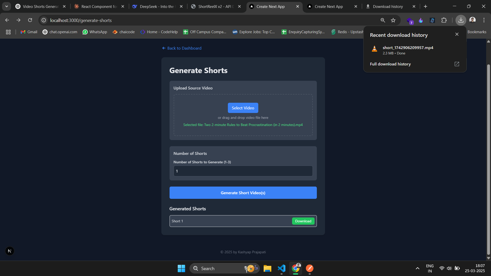
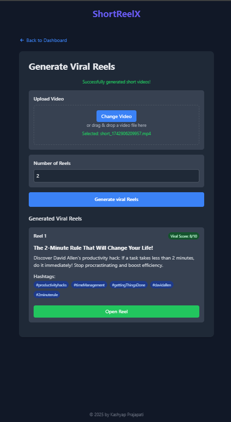
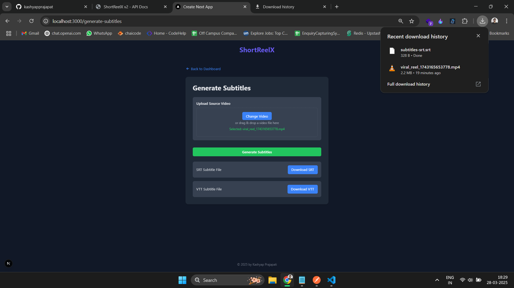

# ShortReelX

ShortReelX is an AI-powered tool that transforms long videos into engaging YouTube Shorts, Instagram Reels, and other social media clips with maximum impact and virality.

---

# ShortReelX 
is a fusion of three powerful words:

###### Short → Represents YouTube Shorts and short-form video content.
###### Reel → Represents Instagram Reels, TikTok videos, and other short video formats.
###### X → Symbolizes AI, innovation, and limitless possibilities (like SpaceX, OpenAI, etc.).

---

### Live Render.com Link --> https://shortreelx-6l7e.onrender.com/
### Live vercel Link --> https://shortreelx.vercel.app

---
### 25 Rank On Peerlist Launchpad  25/250


---

## Live Demo Images  

| **Feature** | **Preview** |
|------------|------------|
| **Laptop View** |  |
| **Generate Shorts Form** |  |
| **Download Shorts (Top Right)** |  |
| **Get Exciting Thumbnails Form** |  |
| **Download Thumbnails (Top Right)** |  |
| **Enhanced Thumbnail Form** |  |
| **Download Enhanced Thumbnail** |  |
| **Get Viral Reels Form** |  |
| **Download Viral Reels (Top Right)** |  |
| **Get Subtitles Form** |  |
| **Download Subtitles File (Top Right)** |  |
| **Get Hashtag Form** |  |
| **Get all Hashtags Copy & paste** |  |
| **Tablet View** |  |
| **Mobile View** |  |
| **Watch View (Under Production)** |  |

---


-------
-------

### New Feature Launch 🚀 🔥🎆
## 1


---

### Glimpls of hashtag Generator 
## 3


---
## 4 Glimpls of hashtag Generator response


---

--------------------------------------------------------------------------------


## Forking and Contributing to the Repository 🧑🏻‍💻

Follow the steps below to fork this repository and set it up on your local machine for development:

### 1. Fork the Repository
- Navigate to the [ShortReelX Frontend GitHub repository](https://github.com/kashyapprajapat/shortreelx_frontend).
- Click on the **Fork** button at the top-right corner of the page.
- Select your GitHub account as the destination for the fork.

### 2. Clone the Forked Repository
Once you have forked the repository, clone it to your local machine using the following command:

```bash
git clone https://github.com/kashyapprajapat/shortreelx_frontend.git
```


### 3. Install Dependencies
Navigate to the project folder and install the dependencies using `npm`:

```bash
cd shortreelx_frontend
npm install
```

This will install all the necessary packages listed in the `package.json` file.

### 4. Start the Development Server
To start the development server and begin working on the project, run the following command:

```bash
npm run dev
```

This will launch the project in development mode and you'll be able to access it at `http://localhost:3000`.

### 5. Make Changes and Create a Branch
Before you start making any changes, create a new branch to work on. This helps keep your changes separate from the main codebase.

```bash
git checkout -b your-feature-branch
```

Replace `your-feature-branch` with a descriptive name for the branch you are working on.

### 6. Commit Your Changes
After making changes, commit your changes with a clear and concise message:

```bash
git add .
git commit -m "Description of changes"
```

### 7. Push Changes to Your Fork
Push your changes to your forked repository on GitHub:

```bash
git push origin your-feature-branch
```

### 8. Create a Pull Request
Once your changes are pushed, navigate to your forked repository on GitHub.
- You'll see a **Compare & Pull Request** button.
- Click on it and provide a description of the changes you've made.
- Submit the pull request (PR) to the original repository.

### 9. Wait for Review
Once the pull request is submitted, it will be reviewed. If everything looks good, it will be merged into the main repository.

---

Thank you for contributing to ShortReelX Frontend! If you have any questions or issues, feel free to reach out.
