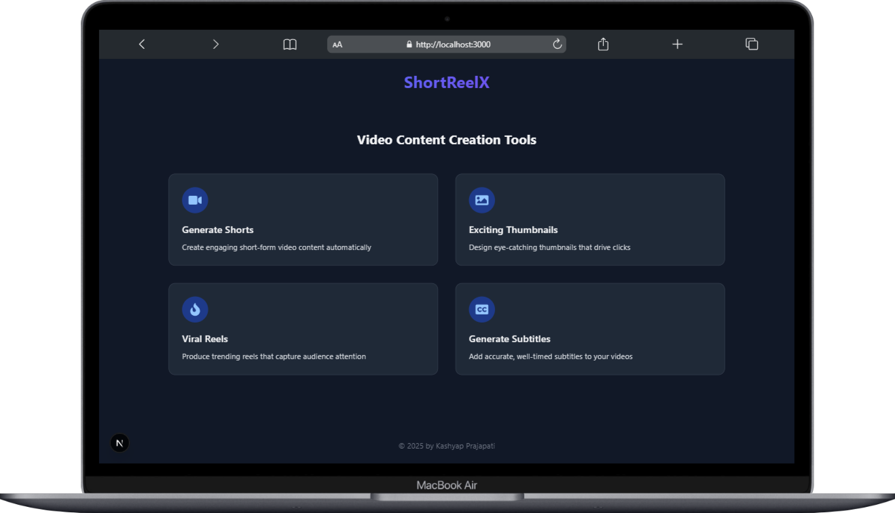
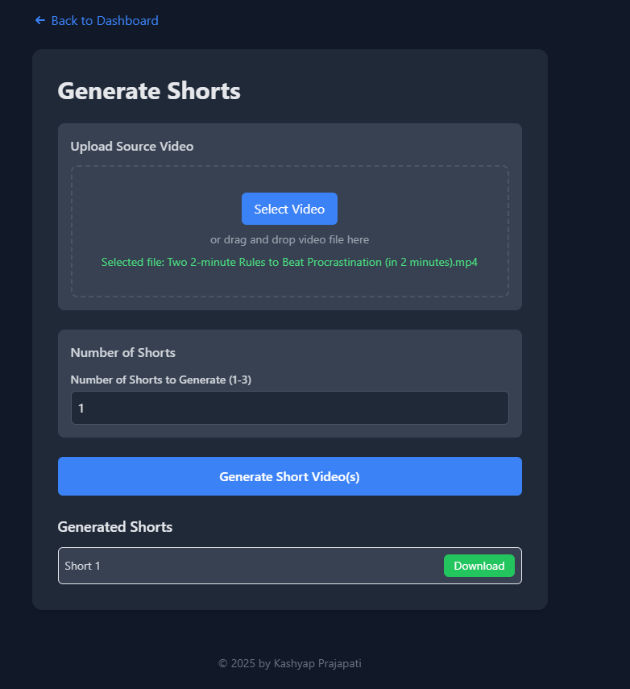
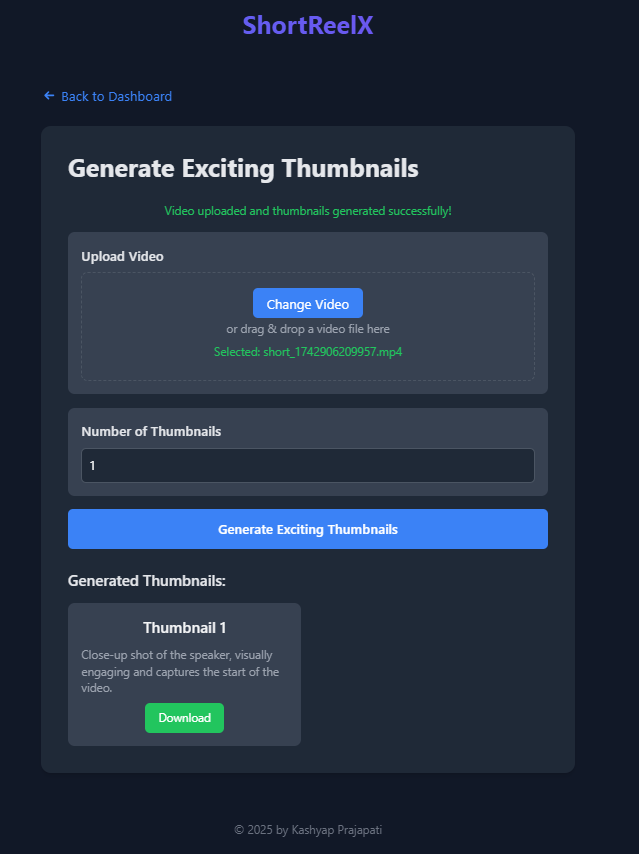
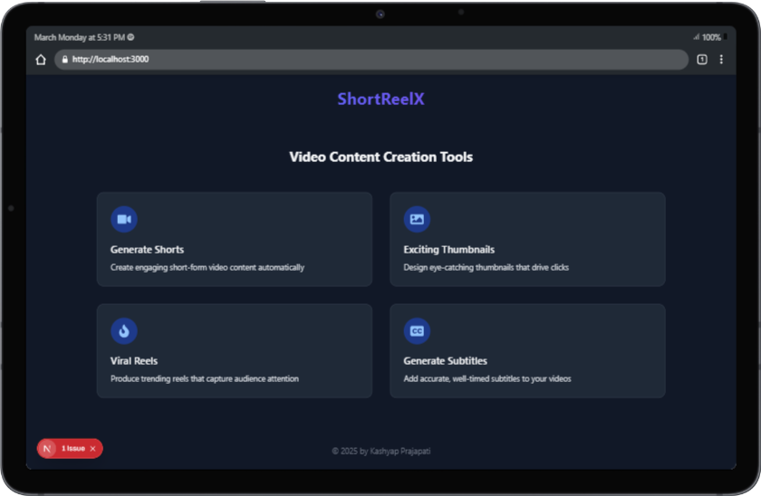

# ShortReelX

ShortReelX is an AI-powered tool that transforms long videos into engaging YouTube Shorts, Instagram Reels, and other social media clips with maximum impact and virality.

---

# ShortReelX 
is a fusion of three powerful words:

###### Short → Represents YouTube Shorts and short-form video content.
###### Reel → Represents Instagram Reels, TikTok videos, and other short video formats.
###### X → Symbolizes AI, innovation, and limitless possibilities (like SpaceX, OpenAI, etc.).

###### Laptop view

###### Generate shorts Form

##### Download shorts right side top

###### Get Exciting Thumnails Form

##### Download Thumbnails right side top

###### Get Viral Reels Form

##### Download Viral Reels right side top

###### Get Subtitles Form

##### Download Subtitles File right side top

###### Tablet View

###### Mobile View

###### Watch view -- under production

